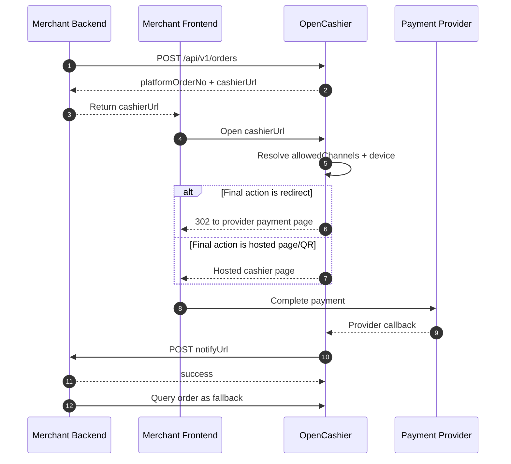
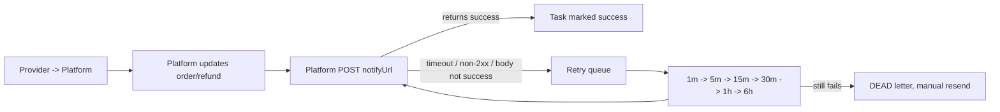

# Merchant Integration Guide

This document describes how external business systems, merchant backends, or SaaS platforms should integrate with OpenCashier, including signing, core APIs, async notifications, and integration tips.

> The Merchant API currently supports `HMAC-SHA256` signatures only. `RSA2` is not supported.

## 1. Overview

### 1.1 Recommended integration mode

OpenCashier recommends the hosted cashier flow:

1. Merchant backend calls the create order API.
2. Platform returns `platformOrderNo` and `cashierUrl`.
3. Merchant frontend redirects to `cashierUrl`.
4. Platform decides the final payment action based on allowed channels and device.
5. After payment succeeds, the platform receives provider callbacks and forwards to the merchant `notifyUrl`.
6. Merchant updates business state from async notification, and confirms by query as fallback.

Benefits:

- Merchants only integrate a single set of order, refund, and notification APIs.
- Merchants do not need to handle Alipay/Stripe signature and callback differences.
- Platform can manage routing, fallback, session reuse, and notification retries.

### 1.2 End-to-end flow



### 1.3 Integration principles

- Merchant systems do not call provider callbacks directly.
- Merchant systems only receive notifications forwarded by OpenCashier.
- `cashierUrl` is the standard payment entry; use it by default.
- If an order must use a specific brand, narrow `allowedChannels` to avoid redundant selection UI.

### 1.4 Core API summary

| Capability | Method | Path | Description |
| --- | --- | --- | --- |
| Create order | `POST` | `/api/v1/orders` | Create payment order and return `cashierUrl` |
| Query order | `GET` | `/api/v1/orders?merchantOrderNo=...` | Query by merchant order number |
| Query order | `GET` | `/api/v1/orders/{platformOrderNo}` | Query by platform order number |
| Close order | `POST` | `/api/v1/orders/{platformOrderNo}/close` | Close an unpaid order |
| Create refund | `POST` | `/api/v1/refunds` | Create a refund for a paid order |
| Query refund | `GET` | `/api/v1/refunds/{merchantRefundNo}` | Query by merchant refund number |
| Fetch cashier session | `GET` | `/api/v1/cashier/{cashierToken}` | Optional, for custom cashier UI |

## 2. Pre-integration Setup

### 2.1 Info the platform provides to merchants

Before integration, the platform should provide:

- `appId`
- `appSecret`
- API base URL, e.g. `https://pay.example.com/api/v1`
- Allowed channel list, e.g. `alipay_qr`, `alipay_page`, `alipay_wap`, `stripe_checkout`

Recommended approach: create merchant apps via the admin UI or `POST /api/v1/admin/merchants`, then send `appId`, `appSecret`, and API base to the merchant.

For local testing, when `ENABLE_DEMO_DATA=1` is set, the repo auto-creates two HMAC demo apps:

- `demo_app` / `demo_app_secret`
- `demo_app_other` / `demo_app_other_secret`

### 2.2 Info merchants must prepare

At minimum, merchants must provide:

- `notifyUrl` (async notification URL)
- Optional `returnUrl` (payment completion redirect)

`notifyUrl` requirements:

- Reachable by the platform server
- Accepts `POST application/json`
- Must return plain text `success`

### 2.3 Current channel availability

| Brand | Recommended `allowedChannels` | Status | Notes |
| --- | --- | --- | --- |
| Alipay | `["alipay_qr", "alipay_page", "alipay_wap"]` | Available | Real create/query/close/refund and webhook verification supported |
| Stripe | `["stripe_checkout"]` | Available | Hosted Checkout, query, session expire/close, refund, webhook verification; card only |
| WeChat Pay | `["wechat_qr", "wechat_jsapi"]` | Testing | API direct integration scaffolded |
| PayPal | `["paypal_checkout"]` | Not yet available | Reserved channel code; real flow not finished |

> If the order must use a specific brand, pass the corresponding `allowedChannels` so the platform can jump directly to the final action instead of showing an unnecessary brand selection page.

### 2.4 Base URLs

- API base: `{your-host}/api/v1`
- Swagger: `{your-host}/api/docs`

Local defaults:

- API: `http://localhost:3000/api/v1`
- Swagger: `http://localhost:3000/api/docs`
- Hosted cashier entry: `http://localhost:3000/api/cashier/{cashierToken}`
- Web: `http://localhost:5173`

After deployment, you can copy the API base and Swagger URLs directly from the “Merchant Apps” page in the admin UI.

## 3. Response Envelope & Auth

### 3.1 Unified response format

Except for provider-native callbacks, Merchant APIs return:

```json
{
  "code": "SUCCESS",
  "message": "OK",
  "requestId": "0e9cfed4-2d31-4b3b-8d54-fdfb3c61b8f0",
  "data": {}
}
```

Field description:

- `code`: business code (do not rely solely on HTTP status)
- `message`: human-readable error
- `requestId`: trace ID
- `data`: business payload (null on failure)

You can also send `X-Request-Id`; the platform will echo it in headers and body.

### 3.2 Required merchant headers

All merchant APIs require:

| Header | Required | Description |
| --- | --- | --- |
| `X-App-Id` | Yes | Merchant app ID |
| `X-Timestamp` | Yes | Millisecond timestamp |
| `X-Nonce` | Yes | Random nonce (anti-replay) |
| `X-Sign-Type` | Yes | Always `HMAC-SHA256` |
| `X-Sign` | Yes | Request signature |
| `Idempotency-Key` | Required for writes | Required for create/close/refund |
| `X-Request-Id` | No | Trace ID |

Security constraints:

- `X-Timestamp` must be within 5 minutes of server time
- `X-Nonce` cannot be replayed in a short window
- `Idempotency-Key` ensures write idempotency

## 4. Signatures & Idempotency

### 4.1 Signature string

The signature content has 6 lines joined by `\n`:

```text
HTTP_METHOD
PATH_WITH_SORTED_QUERY
X-App-Id
X-Timestamp
X-Nonce
SHA256(CANONICAL_JSON_BODY)
```

Notes:

- `HTTP_METHOD`: uppercase, e.g. `POST`, `GET`
- `PATH_WITH_SORTED_QUERY`: path + query only, no domain
- Query parameters sorted by key, then value
- Request body uses stable JSON serialization:
  - Object keys sorted lexicographically
  - Arrays preserve order
  - Empty body uses empty string

Signature algorithm:

```text
hex(HMAC_SHA256(appSecret, signingContent))
```

Example:

```text
GET
/api/v1/orders?merchantOrderNo=ORDER_10001
demo_app
1741852800000
8f1b91f90f7f4d9a
e3b0c44298fc1c149afbf4c8996fb92427ae41e4649b934ca495991b7852b855
```

### 4.2 Node.js signing example

```js
import { createHash, createHmac } from "node:crypto";

function canonicalPath(path) {
  const url = new URL(path, "http://localhost");
  const entries = [...url.searchParams.entries()].sort(([aKey, aValue], [bKey, bValue]) => {
    if (aKey === bKey) {
      return aValue.localeCompare(bValue);
    }

    return aKey.localeCompare(bKey);
  });
  const query = new URLSearchParams(entries).toString();

  return query ? `${url.pathname}?${query}` : url.pathname;
}

function sortJsonValue(value) {
  if (Array.isArray(value)) {
    return value.map((item) => sortJsonValue(item));
  }

  if (value && typeof value === "object" && Object.getPrototypeOf(value) === Object.prototype) {
    return Object.keys(value)
      .sort()
      .reduce((result, key) => {
        result[key] = sortJsonValue(value[key]);
        return result;
      }, {});
  }

  return value;
}

function stableStringify(value) {
  return JSON.stringify(sortJsonValue(value));
}

function sha256Hex(content) {
  return createHash("sha256").update(content).digest("hex");
}

export function signMerchantRequest({ method, path, appId, timestamp, nonce, body, appSecret }) {
  const canonicalBody = typeof body === "undefined" ? "" : stableStringify(body);
  const signingContent = [
    method.toUpperCase(),
    canonicalPath(path),
    appId,
    timestamp,
    nonce,
    sha256Hex(canonicalBody)
  ].join("\n");

  return createHmac("sha256", appSecret).update(signingContent).digest("hex");
}
```

### 4.3 Idempotency rules

Write APIs must include `Idempotency-Key`:

- `POST /api/v1/orders`
- `POST /api/v1/orders/{platformOrderNo}/close`
- `POST /api/v1/refunds`

Idempotency behavior:

- Same `Idempotency-Key` + same payload: return the same result
- Same `Idempotency-Key` + different payload: `IDEMPOTENT_CONFLICT`
- Reuse `X-Nonce`: `NONCE_REPLAY`

Recommended key patterns:

- Create order: `order:{merchantOrderNo}:create`
- Close order: `order:{platformOrderNo}:close`
- Create refund: `refund:{merchantRefundNo}:create`

Include the action and business key so retries can safely reuse the same idempotency key and remain debuggable.

## 5. Standard Integration Flow

### 5.1 Create order

API:

- `POST /api/v1/orders`

Typical scenarios:

- User is ready to pay
- Merchant wants the unified payment entry `cashierUrl`

#### Request fields

| Field | Required | Description |
| --- | --- | --- |
| `merchantOrderNo` | Yes | Merchant order ID (unique per app) |
| `amount` | Yes | Amount in cents |
| `currency` | Yes | Currency, e.g. `CNY` |
| `subject` | Yes | Order title |
| `description` | No | Order description |
| `notifyUrl` | Yes | Merchant async notification URL |
| `returnUrl` | No | Redirect URL after payment |
| `expireInSeconds` | No | TTL, currently `60 ~ 86400` seconds |
| `allowedChannels` | No | Allowed channels for this order |
| `metadata` | No | Custom passthrough fields |

Notes:

- `expireInSeconds` defaults to `900`
- If `stripe_checkout` is allowed, platform will bump TTL to at least `3600`
- If `allowedChannels` is omitted, platform uses merchant app defaults
- `allowedChannels` defines the allowed scope, not a frontend button list

#### Mapping from payment intent to `allowedChannels`

| Payment intent | Recommended `allowedChannels` | Platform behavior |
| --- | --- | --- |
| Alipay | `["alipay_qr", "alipay_page", "alipay_wap"]` | Show QR or redirect based on device/back-end capability |
| WeChat Pay | `["wechat_qr", "wechat_jsapi"]` | Choose final format based on device and capability |
| Stripe | `["stripe_checkout"]` | Redirect to Stripe Checkout |
| PayPal | `["paypal_checkout"]` | Redirect to PayPal Checkout (future) |

If your use case only allows a specific channel, you can pass a narrower list, e.g.:

- `["alipay_page"]`
- `["stripe_checkout"]`

#### Request example

```json
{
  "merchantOrderNo": "ORDER_202603130001",
  "amount": 9900,
  "currency": "CNY",
  "subject": "VIP Membership",
  "description": "Annual subscription",
  "notifyUrl": "https://merchant.example.com/pay/notify",
  "returnUrl": "https://merchant.example.com/pay/result",
  "expireInSeconds": 900,
  "allowedChannels": ["alipay_qr", "alipay_page", "alipay_wap"],
  "metadata": {
    "scene": "web_checkout",
    "userId": "U10001"
  }
}
```

#### Success response example

```json
{
  "code": "SUCCESS",
  "message": "OK",
  "requestId": "req_123",
  "data": {
    "platformOrderNo": "P20260313143000999",
    "merchantOrderNo": "ORDER_202603130001",
    "status": "WAIT_PAY",
    "cashierUrl": "https://pay.example.com/api/cashier/eyJwbGF0Zm9ybU9yZGVyTm8iOiJQMjAyNjAzMTMxNDMwMDA5OTkiLCJleHBpcmVUaW1lIjoiMjAyNi0wMy0xM1QxNDo0NTowMC4wMDBaIn0.signature",
    "expireTime": "2026-03-13T14:45:00.000Z",
    "channels": [
      {
        "providerCode": "ALIPAY",
        "displayName": "Alipay",
        "integrationMode": "OFFICIAL_NODE_SDK",
        "supportedChannels": ["alipay_qr", "alipay_page", "alipay_wap"],
        "officialSdkPackage": "alipay-sdk",
        "enabled": true,
        "note": "Prefer official Alipay Node SDK; QR prepay, web, WAP, query, close, refund, and webhook verification are supported."
      }
    ]
  }
}
```

After creating an order, merchants should store:

- `platformOrderNo`
- `merchantOrderNo`
- `cashierUrl`
- `expireTime`

### 5.2 Open payment entry

Standard flow:

1. Merchant backend creates an order.
2. Return `cashierUrl` to frontend.
3. Frontend redirects to `cashierUrl`.

Notes about `cashierUrl`:

- It is a backend-hosted entry, not a frontend URL
- The platform may respond with a `302` redirect to provider page
- Or render a hosted QR/cashier page
- If only one brand is allowed, platform should jump directly to final action

> For most merchants, using `cashierUrl` directly is sufficient. Avoid building your own channel routing unless necessary.

### 5.3 Query order

Two query methods:

- `GET /api/v1/orders?merchantOrderNo={merchantOrderNo}`
- `GET /api/v1/orders/{platformOrderNo}`

Use cases:

- Confirm status before receiving notification
- Fallback when notifications fail or delay
- Render result or order detail pages

Returned fields include:

- `platformOrderNo`
- `merchantOrderNo`
- `amount`
- `paidAmount`
- `currency`
- `subject`
- `status`
- `channel`
- `notifyUrl`
- `returnUrl`
- `expireTime`
- `createdAt`
- `paidTime`
- `allowedChannels`
- `metadata`
- `cashierUrl`

### 5.4 Close order

API:

- `POST /api/v1/orders/{platformOrderNo}/close`

Use cases:

- User abandons payment
- Order times out and merchant closes it
- Business cancels the transaction

Empty body is acceptable:

```json
{}
```

Optional reason field:

```json
{
  "reason": "merchant_cancel"
}
```

Closing result is reflected in order status. Use query API to fetch the final state.

### 5.5 Create refund

API:

- `POST /api/v1/refunds`

Typical request:

```json
{
  "platformOrderNo": "P202603120001",
  "merchantRefundNo": "R202603120001",
  "refundAmount": 3000,
  "reason": "user_cancel"
}
```

Field description:

| Field | Required | Description |
| --- | --- | --- |
| `platformOrderNo` | Yes | Platform order number |
| `merchantRefundNo` | Yes | Merchant refund number (unique per app) |
| `refundAmount` | Yes | Refund amount in cents |
| `reason` | Yes | Refund reason |

Notes:

- Refunds must be tied to `platformOrderNo`
- Each `merchantRefundNo` can be used only once
- If channel is not configured or unsupported, returns `CHANNEL_UNAVAILABLE`

### 5.6 Query refund

API:

- `GET /api/v1/refunds/{merchantRefundNo}`

Returns fields such as:

- `merchantRefundNo`
- `platformRefundNo`
- `platformOrderNo`
- `refundAmount`
- `status`
- `reason`
- `createdAt`
- `successTime`

### 5.7 Custom cashier UI (optional)

If you need a custom frontend payment page instead of the hosted cashier:

1. Extract `cashierToken` from the end of `cashierUrl`.
2. Call `GET /api/v1/cashier/{cashierToken}`.
3. Render QR codes or redirects based on returned `channels`.

Key fields in the response:

- `order`
- `channels`
- `channels[].sessionStatus`
- `channels[].actionType`
- `channels[].qrContent`
- `channels[].payUrl`

Guidance:

- For single-brand scenarios, prefer the hosted `cashierUrl`
- Only build custom UI when you truly need it

## 6. Merchant Async Notifications

### 6.1 Delivery mechanism

After payment or refund succeeds, the platform posts to the merchant `notifyUrl`.

Currently supported event types:

- `PAY_SUCCESS`
- `REFUND_SUCCESS`

Flow:



### 6.2 Notification headers

Platform notifies with these headers:

| Header | Description |
| --- | --- |
| `X-App-Id` | Merchant app ID |
| `X-Notify-Id` | Platform notification ID |
| `X-Timestamp` | Millisecond timestamp |
| `X-Nonce` | Random nonce |
| `X-Sign-Type` | Always `HMAC-SHA256` |
| `X-Sign` | Notification signature |

Notes:

- Header names are case-insensitive
- The signing key is the merchant `appSecret`

### 6.3 Notification signature

Signature content has 4 lines:

```text
X-Notify-Id
X-Timestamp
X-Nonce
SHA256(REQUEST_BODY)
```

Signature algorithm:

```text
hex(HMAC_SHA256(appSecret, signingContent))
```

### 6.4 Notification payload examples

Payment success:

```json
{
  "notifyId": "N20260313143100123",
  "businessType": "PAY_ORDER",
  "businessNo": "P20260313143000999",
  "eventType": "PAY_SUCCESS",
  "platformOrderNo": "P20260313143000999",
  "merchantOrderNo": "ORDER_202603130001",
  "appId": "demo_app",
  "amount": 9900,
  "paidAmount": 9900,
  "status": "SUCCESS",
  "currency": "CNY",
  "channel": "alipay_page",
  "paidTime": "2026-03-13T14:31:00.000Z"
}
```

Refund success:

```json
{
  "notifyId": "N20260313150100999",
  "businessType": "REFUND_ORDER",
  "businessNo": "R20260313150000123",
  "eventType": "REFUND_SUCCESS",
  "platformRefundNo": "R20260313150000123",
  "merchantRefundNo": "REFUND_202603130001",
  "platformOrderNo": "P20260313143000999",
  "appId": "demo_app",
  "refundAmount": 3000,
  "status": "SUCCESS",
  "reason": "user_cancel",
  "successTime": "2026-03-13T15:00:02.000Z"
}
```

### 6.5 Node.js verification example

```js
import { createHash, createHmac, timingSafeEqual } from "node:crypto";

function sha256Hex(content) {
  return createHash("sha256").update(content).digest("hex");
}

export function verifyPlatformNotify({ headers, rawBody, appSecret }) {
  const notifyId = headers["x-notify-id"];
  const timestamp = headers["x-timestamp"];
  const nonce = headers["x-nonce"];
  const signature = headers["x-sign"];
  const signType = headers["x-sign-type"];

  if (signType !== "HMAC-SHA256") {
    return false;
  }

  const content = [notifyId, timestamp, nonce, sha256Hex(rawBody)].join("\n");
  const expected = createHmac("sha256", appSecret).update(content).digest("hex");

  if (!signature || expected.length !== signature.length) {
    return false;
  }

  return timingSafeEqual(Buffer.from(expected), Buffer.from(signature));
}
```

### 6.6 Required merchant response

After successfully processing, return plain text:

```text
success
```

Notification is considered failed if:

- HTTP status is not `2xx`
- Request times out
- Body is not plain `success`

## 7. Statuses & Error Codes

### 7.1 Order status

| Status | Meaning |
| --- | --- |
| `WAIT_PAY` | Waiting for payment |
| `PAYING` | Payment in progress |
| `SUCCESS` | Paid successfully |
| `CLOSED` | Closed |
| `EXPIRED` | Expired |
| `REFUND_PART` | Partially refunded |
| `REFUND_ALL` | Fully refunded |

### 7.2 Refund status

| Status | Meaning |
| --- | --- |
| `CREATED` | Created |
| `PROCESSING` | Processing |
| `SUCCESS` | Refunded |
| `FAILED` | Failed |
| `CLOSED` | Closed |

### 7.3 Common error codes

| Code | Description |
| --- | --- |
| `AUTH_INVALID` | Auth failure, invalid `appId`, invalid timestamp, or app disabled |
| `SIGN_INVALID` | Signature invalid |
| `NONCE_REPLAY` | `X-Nonce` reused |
| `PARAM_INVALID` | Missing or invalid params |
| `IDEMPOTENT_CONFLICT` | Same `Idempotency-Key` with different payload |
| `ORDER_NOT_FOUND` | Order not found |
| `CHANNEL_UNAVAILABLE` | Channel not enabled/configured/unsupported |
| `SYSTEM_BUSY` | Internal error or temporary unavailable |

## 8. Integration & Go-live Tips

### 8.1 Recommended integration order

1. Use provided `appId` and `appSecret` to sign requests
2. Call create order API to get `cashierUrl`
3. Open `cashierUrl` in frontend
4. Complete a real payment
5. Verify `notifyUrl` receives `PAY_SUCCESS`
6. Query order to confirm status
7. Create refund and confirm `REFUND_SUCCESS`

### 8.2 Local integration tips

- Use demo app `demo_app` for local testing
- Swagger for quick inspection: `/api/docs`
- Merchant smoke test: `pnpm smoke:merchant`
- For local Alipay testing, expose platform callbacks via HTTPS tunnel

### 8.3 Common questions

- After going public, can anyone change admin settings?
  No. `/api/v1/admin/*` requires admin auth. Without admin credentials, the UI cannot read or modify configs, orders, or merchant apps.
- What should `allowedChannels` be?
  Pass payment intent, not button list. For “Alipay payment”, use `["alipay_qr", "alipay_page", "alipay_wap"]`.
- Where to find the API base path?
  The admin “Merchant Apps” page shows the Merchant API base URL. In deployment, it is `APP_BASE_URL + /api/v1`.
- How should `appId` / `appSecret` be provided?
  Create a merchant app via admin, then send the created credentials to the merchant.
- What should `notifyUrl` return on success?
  Return HTTP `2xx` and body must be plain `success`.

### 8.4 Pre-launch checklist

- Request signing and notification verification implemented
- `Idempotency-Key` used for all write APIs
- `notifyUrl` reachable by platform server
- Merchant notification handling is idempotent
- Fallback query implemented for notification failures
- `allowedChannels` matches payment intent

## 9. Shortest integration path

If you want the minimal integration path, follow:

1. Implement HMAC signing in merchant backend
2. Call `POST /api/v1/orders`
3. Redirect frontend to `cashierUrl`
4. Receive and verify platform notification
5. Use `GET /api/v1/orders/{platformOrderNo}` for fallback
6. Integrate refunds with `POST /api/v1/refunds`

For most cases, this is sufficient for the first integration.
