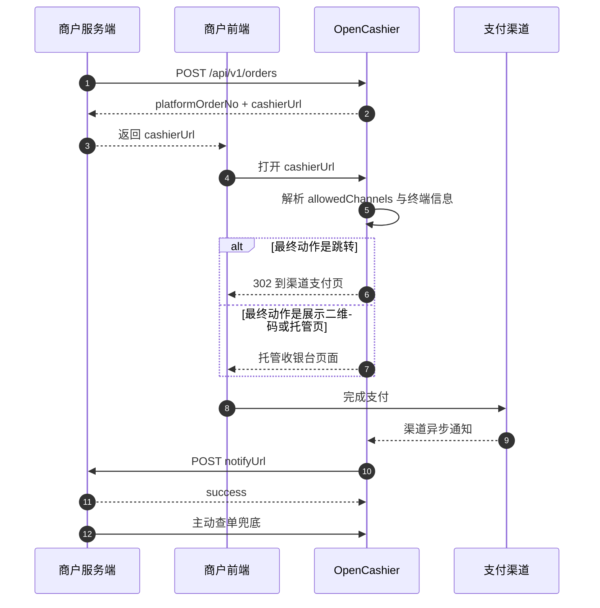
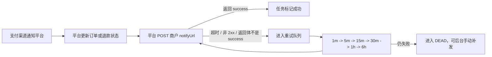

# 商户接入指南

本文档向 OpenCashier 的外部业务系统、商户自有系统或 SaaS 平台服务端说明标准接入方式、请求签名、核心接口、异步通知和联调建议。

> 当前对外商户接口仅支持 `HMAC-SHA256` 签名，不支持 `RSA2` 商户签名接入。

## 1. 接入概览

### 1.1 推荐接入方式

OpenCashier 推荐采用“平台托管收银台”模式：

1. 商户服务端调用创建订单接口。
2. 平台返回 `platformOrderNo` 和 `cashierUrl`。
3. 商户前端直接跳转到 `cashierUrl`。
4. 平台根据订单允许的渠道范围和当前终端，决定最终支付动作。
5. 支付成功后，平台统一接收渠道异步通知，再转发给商户的 `notifyUrl`。
6. 商户通过异步通知更新业务状态，并通过主动查单做兜底。

优点：

- 商户只需对接一套订单、退款和通知接口。
- 商户不需要直接处理支付宝、Stripe 等渠道的签名和回调差异。
- 平台可以统一做渠道路由、失败回退、会话复用和通知重试。

### 1.2 整体流程



### 1.3 接入原则

- 商户系统不直接对接支付宝、Stripe 等渠道回调地址。
- 商户系统只需要接收平台转发的商户通知。
- `cashierUrl` 是标准支付入口，优先直接使用。
- 如果订单已明确只能走某一个支付品牌，应通过 `allowedChannels` 收窄路由范围，避免用户在同一支付品牌内再次选择。

### 1.4 核心接口总览

| 能力 | 方法 | 路径 | 说明 |
| --- | --- | --- | --- |
| 创建订单 | `POST` | `/api/v1/orders` | 创建支付订单并返回 `cashierUrl` |
| 查单 | `GET` | `/api/v1/orders?merchantOrderNo=...` | 按商户订单号查询 |
| 查单 | `GET` | `/api/v1/orders/{platformOrderNo}` | 按平台订单号查询 |
| 关单 | `POST` | `/api/v1/orders/{platformOrderNo}/close` | 关闭未支付订单 |
| 发起退款 | `POST` | `/api/v1/refunds` | 为已支付订单创建退款 |
| 查询退款 | `GET` | `/api/v1/refunds/{merchantRefundNo}` | 按商户退款单号查询 |
| 拉取收银台会话 | `GET` | `/api/v1/cashier/{cashierToken}` | 可选，用于自定义收银台 |

## 2. 接入前准备

### 2.1 平台侧提供给商户的信息

在正式接入前，平台通常需要向商户提供以下信息：

- `appId`
- `appSecret`
- 平台 API 根地址，例如 `https://pay.example.com/api/v1`
- 商户应用允许使用的渠道列表，例如 `alipay_qr`、`alipay_page`、`alipay_wap`、`stripe_checkout`

推荐做法不是把预置 demo app 直接发给商户，而是由平台管理员在后台“商户应用”页，或通过管理员 API `POST /api/v1/admin/merchants` 创建商户应用，然后把返回的 `appId`、`appSecret` 和 API 根地址发给商户。

本地联调时，如果环境变量启用了 `ENABLE_DEMO_DATA=1`，仓库会自动生成两个 HMAC 示例应用：

- `demo_app` / `demo_app_secret`
- `demo_app_other` / `demo_app_other_secret`

### 2.2 商户侧需要准备的信息

商户在下单时至少需要提供：

- 商户异步通知地址 `notifyUrl`
- 可选的支付完成返回地址 `returnUrl`

`notifyUrl` 要求如下：

- 必须能被平台服务端访问
- 必须支持 `POST application/json`
- 处理成功后必须返回纯文本 `success`

### 2.3 当前渠道能力

| 支付品牌 | 推荐 `allowedChannels` | 当前状态 | 说明 |
| --- | --- | --- | --- |
| 支付宝 | `["alipay_qr", "alipay_page", "alipay_wap"]` | 可用 | 已支持真实下单、查单、关单、退款和回调验签 |
| Stripe | `["stripe_checkout"]` | 可用 | 已支持 Hosted Checkout、查单、会话失效或关单、退款和 webhook 验签；当前仅开放 `card` |
| 微信支付 | `["wechat_qr", "wechat_jsapi"]` | 测试中 | 当前主要为直连 API 预留和骨架能力 |
| PayPal | `["paypal_checkout"]` | 暂未开放 | 当前保留渠道编码和集成位，真实交易链路尚未完成 |

> 如果你的业务已经明确本次订单要走某一个支付品牌，建议直接传该品牌对应的 `allowedChannels`，让平台直接进入最终支付动作，而不是先展示一个无意义的品牌选择页。

### 2.4 allowedChannels 取值说明

`allowedChannels` 表示“这笔订单允许平台在什么支付范围内完成支付”。`merchant-quickstart` 里的 `OPENCASHIER_ALLOWED_CHANNELS` 只是把同一组值按逗号分隔写进 `.env`，然后在创建订单时透传给订单接口的 `allowedChannels`。

如果你还需要看 app-scoped 渠道配置 API、quickstart 自动写配置的路径，或者每个渠道配置字段的说明，请继续看 [渠道配置参考](./provider-config-reference)。

| 渠道编码 | 适用场景 | 当前说明 |
| --- | --- | --- |
| `alipay_qr` | PC 收银台展示二维码，由用户使用支付宝扫码支付 | 支付宝能力已可用 |
| `alipay_page` | PC 浏览器直接跳转支付宝电脑网站支付 | Quickstart 默认值；最适合只启动 API 和 quickstart 两个进程的接入路径 |
| `alipay_wap` | 手机浏览器跳转支付宝手机网站支付 | 支付宝能力已可用 |
| `wechat_qr` | PC 场景展示微信支付二维码 | 微信支付仍在测试中 |
| `wechat_jsapi` | 微信内 WebView 或公众号场景 | 微信支付仍在测试中，仅适合微信内环境 |
| `stripe_checkout` | 直接跳转 Stripe Hosted Checkout | Stripe 能力已可用 |
| `paypal_checkout` | 未来 PayPal Checkout 场景 | 预留渠道编码，暂未开放真实交易 |

推荐写法：

- 支付宝品牌路由：`["alipay_qr", "alipay_page", "alipay_wap"]`
- quickstart 默认直跳：`["alipay_page"]`
- Stripe 单渠道：`["stripe_checkout"]`

如果你已经明确要把用户直接带到某一个最终支付入口，优先传单个渠道值；如果你希望平台按终端能力在同一支付品牌内自动选择最终动作，再传该品牌对应的整组渠道。

### 2.5 基础地址

- API 根地址：`{your-host}/api/v1`
- Swagger：`{your-host}/api/docs`

本地默认地址：

- API：`http://localhost:3000/api/v1`
- Swagger：`http://localhost:3000/api/docs`
- Hosted cashier entry：`http://localhost:3000/api/cashier/{cashierToken}`
- Web：`http://localhost:5173`

部署完成后，也可以直接在后台“商户应用”页复制 API 根地址和 Swagger 地址，不需要自己猜平台 API path。

## 3. 响应格式与认证约定

### 3.1 统一响应格式

除渠道原生回调入口外，商户接口统一返回以下结构：

```json
{
  "code": "SUCCESS",
  "message": "OK",
  "requestId": "0e9cfed4-2d31-4b3b-8d54-fdfb3c61b8f0",
  "data": {}
}
```

字段说明：

- `code`：业务码，不要只依赖 HTTP 状态码判断业务成功与否
- `message`：可读错误信息
- `requestId`：链路追踪 ID
- `data`：业务数据，失败时为 `null`

你也可以主动传 `X-Request-Id`，平台会原样透传到响应头和响应体中。

### 3.2 商户请求头

所有商户接口都要求以下请求头：

| Header | 必填 | 说明 |
| --- | --- | --- |
| `X-App-Id` | 是 | 商户应用 ID |
| `X-Timestamp` | 是 | 毫秒时间戳 |
| `X-Nonce` | 是 | 随机串，防重放 |
| `X-Sign-Type` | 是 | 当前固定为 `HMAC-SHA256` |
| `X-Sign` | 是 | 请求签名 |
| `Idempotency-Key` | 写接口必填 | 创建订单、关单、退款时必填 |
| `X-Request-Id` | 否 | 便于链路追踪 |

平台的安全约束如下：

- `X-Timestamp` 与平台时间误差不得超过 5 分钟
- `X-Nonce` 不允许重放，平台会在短窗口内做防重校验
- `Idempotency-Key` 用于确保写接口幂等

## 4. 请求签名与幂等

### 4.1 签名串拼接规则

商户请求的签名串由 6 行组成，使用换行符 `\n` 连接：

```text
HTTP_METHOD
PATH_WITH_SORTED_QUERY
X-App-Id
X-Timestamp
X-Nonce
SHA256(CANONICAL_JSON_BODY)
```

说明如下：

- `HTTP_METHOD`
  需要使用大写，例如 `POST`、`GET`
- `PATH_WITH_SORTED_QUERY`
  只包含 path 和 query，不包含域名
- query 参数按 `key` 升序排序；同名参数按 `value` 升序排序
- request body 使用稳定 JSON 序列化：
  - 对象 key 按字典序排序
  - 数组保持原顺序
  - 没有 body 时使用空字符串

签名算法：

```text
hex(HMAC_SHA256(appSecret, signingContent))
```

示例：

```text
GET
/api/v1/orders?merchantOrderNo=ORDER_10001
demo_app
1741852800000
8f1b91f90f7f4d9a
e3b0c44298fc1c149afbf4c8996fb92427ae41e4649b934ca495991b7852b855
```

### 4.2 Node.js 签名示例

```js
import { createHash, createHmac } from "node:crypto";

function canonicalPath(path) {
  const url = new URL(path, "http://localhost");
  const entries = [...url.searchParams.entries()].sort(([aKey, aValue], [bKey, bValue]) => {
    if (aKey === bKey) {
      return aValue.localeCompare(bValue);
    }

    return aKey.localeCompare(bKey);
  });
  const query = new URLSearchParams(entries).toString();

  return query ? `${url.pathname}?${query}` : url.pathname;
}

function sortJsonValue(value) {
  if (Array.isArray(value)) {
    return value.map((item) => sortJsonValue(item));
  }

  if (value && typeof value === "object" && Object.getPrototypeOf(value) === Object.prototype) {
    return Object.keys(value)
      .sort()
      .reduce((result, key) => {
        result[key] = sortJsonValue(value[key]);
        return result;
      }, {});
  }

  return value;
}

function stableStringify(value) {
  return JSON.stringify(sortJsonValue(value));
}

function sha256Hex(content) {
  return createHash("sha256").update(content).digest("hex");
}

export function signMerchantRequest({ method, path, appId, timestamp, nonce, body, appSecret }) {
  const canonicalBody = typeof body === "undefined" ? "" : stableStringify(body);
  const signingContent = [
    method.toUpperCase(),
    canonicalPath(path),
    appId,
    timestamp,
    nonce,
    sha256Hex(canonicalBody)
  ].join("\n");

  return createHmac("sha256", appSecret).update(signingContent).digest("hex");
}
```

### 4.3 幂等规则

写接口要求使用 `Idempotency-Key`：

- `POST /api/v1/orders`
- `POST /api/v1/orders/{platformOrderNo}/close`
- `POST /api/v1/refunds`

平台幂等行为如下：

- 相同 `Idempotency-Key` + 相同请求参数：返回相同结果
- 相同 `Idempotency-Key` + 不同请求参数：返回 `IDEMPOTENT_CONFLICT`
- 相同 `X-Nonce` 重复使用：返回 `NONCE_REPLAY`

推荐生成规则：

- 创建订单：`order:{merchantOrderNo}:create`
- 关闭订单：`order:{platformOrderNo}:close`
- 创建退款：`refund:{merchantRefundNo}:create`

建议把“动作名 + 业务主键”拼进 key 中，而不是每次都生成一个完全无语义的随机串。这样业务重试时可以稳定复用同一个 key，也方便排查问题。

## 5. 标准接入流程

### 5.1 创建订单

接口：

- `POST /api/v1/orders`

推荐使用场景：

- 用户准备发起支付
- 商户希望拿到平台统一支付入口 `cashierUrl`

#### 请求字段

| 字段 | 必填 | 说明 |
| --- | --- | --- |
| `merchantOrderNo` | 是 | 商户订单号，商户应用内唯一 |
| `amount` | 是 | 订单金额，单位为分 |
| `currency` | 是 | 币种，例如 `CNY` |
| `subject` | 是 | 订单标题 |
| `description` | 否 | 订单描述 |
| `notifyUrl` | 是 | 商户异步通知地址 |
| `returnUrl` | 否 | 支付完成返回地址 |
| `expireInSeconds` | 否 | 订单有效期，当前允许 `60 ~ 86400` 秒 |
| `allowedChannels` | 否 | 本单允许使用的渠道集合 |
| `metadata` | 否 | 业务透传字段 |

补充说明：

- `expireInSeconds` 默认值为 `900`
- 如果订单允许 `stripe_checkout`，平台会自动将有效期提升到至少 `3600` 秒
- `allowedChannels` 不传时，平台使用商户应用默认渠道
- `allowedChannels` 表示“平台可在什么范围内完成支付”，而不是简单的前端按钮列表

#### 支付意图与 `allowedChannels` 的推荐映射

| 业务支付意图 | 推荐 `allowedChannels` | 平台期望行为 |
| --- | --- | --- |
| 支付宝 | `["alipay_qr", "alipay_page", "alipay_wap"]` | 根据终端和后台能力直接展示二维码或自动跳转 |
| 微信支付 | `["wechat_qr", "wechat_jsapi"]` | 根据终端和能力选择最终形态 |
| Stripe | `["stripe_checkout"]` | 直接跳转到 Stripe Checkout |
| PayPal | `["paypal_checkout"]` | 未来直接跳转到 PayPal Checkout |

如果业务已经明确只允许某一种具体支付形态，也可以传更窄的集合，例如：

- `["alipay_page"]`
- `["stripe_checkout"]`

#### 请求示例

```json
{
  "merchantOrderNo": "ORDER_202603130001",
  "amount": 9900,
  "currency": "CNY",
  "subject": "VIP会员",
  "description": "年费会员",
  "notifyUrl": "https://merchant.example.com/pay/notify",
  "returnUrl": "https://merchant.example.com/pay/result",
  "expireInSeconds": 900,
  "allowedChannels": ["alipay_qr", "alipay_page", "alipay_wap"],
  "metadata": {
    "scene": "web_checkout",
    "userId": "U10001"
  }
}
```

#### 成功响应示例

```json
{
  "code": "SUCCESS",
  "message": "OK",
  "requestId": "req_123",
  "data": {
    "platformOrderNo": "P20260313143000999",
    "merchantOrderNo": "ORDER_202603130001",
    "status": "WAIT_PAY",
    "cashierUrl": "https://pay.example.com/api/cashier/eyJwbGF0Zm9ybU9yZGVyTm8iOiJQMjAyNjAzMTMxNDMwMDA5OTkiLCJleHBpcmVUaW1lIjoiMjAyNi0wMy0xM1QxNDo0NTowMC4wMDBaIn0.signature",
    "expireTime": "2026-03-13T14:45:00.000Z",
    "channels": [
      {
        "providerCode": "ALIPAY",
        "displayName": "支付宝",
        "integrationMode": "OFFICIAL_NODE_SDK",
        "supportedChannels": ["alipay_qr", "alipay_page", "alipay_wap"],
        "officialSdkPackage": "alipay-sdk",
        "enabled": true,
        "note": "优先使用支付宝官方 Node SDK；当前已接入二维码预下单、电脑网站支付、WAP 拉起、查单、关单、退款和回调验签。"
      }
    ]
  }
}
```

创建订单后，商户系统建议保存以下字段：

- `platformOrderNo`
- `merchantOrderNo`
- `cashierUrl`
- `expireTime`

### 5.2 拉起支付入口

标准做法如下：

1. 商户服务端创建订单。
2. 将 `cashierUrl` 返回给前端。
3. 前端直接跳转到 `cashierUrl`。

关于 `cashierUrl`，需要注意：

- 它是平台后端托管入口，不等于前端页面地址
- 平台可能直接 `302` 到渠道支付页
- 也可能进入平台托管的扫码页或收银台页
- 如果订单只允许单一支付品牌，平台应直接进入最终支付动作，而不是再让用户点一次相同品牌

> 对大多数商户来说，直接使用 `cashierUrl` 就足够了，不建议自行维护渠道跳转逻辑。

### 5.3 查单

平台提供两种查单方式：

- `GET /api/v1/orders?merchantOrderNo={merchantOrderNo}`
- `GET /api/v1/orders/{platformOrderNo}`

适用场景：

- 商户收到通知前，需要主动确认支付状态
- 通知失败或延迟时，做业务兜底
- 需要展示支付结果页或订单详情页

返回的订单字段包括：

- `platformOrderNo`
- `merchantOrderNo`
- `amount`
- `paidAmount`
- `currency`
- `subject`
- `status`
- `channel`
- `notifyUrl`
- `returnUrl`
- `expireTime`
- `createdAt`
- `paidTime`
- `allowedChannels`
- `metadata`
- `cashierUrl`

### 5.4 关单

接口：

- `POST /api/v1/orders/{platformOrderNo}/close`

适用场景：

- 用户放弃支付
- 订单超时后由商户主动关闭
- 商户业务已取消，不再接受支付

请求体可以传空对象：

```json
{}
```

如果你需要统一保留调用格式，也可以传保留字段：

```json
{
  "reason": "merchant_cancel"
}
```

当前平台的关单结果会反映到订单状态中，商户可通过查单接口获取最终状态。

### 5.5 发起退款

接口：

- `POST /api/v1/refunds`

典型请求体：

```json
{
  "platformOrderNo": "P202603120001",
  "merchantRefundNo": "R202603120001",
  "refundAmount": 3000,
  "reason": "user_cancel"
}
```

字段说明：

| 字段 | 必填 | 说明 |
| --- | --- | --- |
| `platformOrderNo` | 是 | 平台订单号 |
| `merchantRefundNo` | 是 | 商户退款单号，商户应用内唯一 |
| `refundAmount` | 是 | 退款金额，单位为分 |
| `reason` | 是 | 退款原因 |

补充说明：

- 当前退款必须基于 `platformOrderNo`
- 同一个 `merchantRefundNo` 只能对应一笔退款请求
- 如果渠道暂不支持或未配置，平台会返回 `CHANNEL_UNAVAILABLE`

### 5.6 查询退款

接口：

- `GET /api/v1/refunds/{merchantRefundNo}`

商户可通过该接口按商户退款单号查询退款状态。当前返回的核心字段包括：

- `merchantRefundNo`
- `platformRefundNo`
- `platformOrderNo`
- `refundAmount`
- `status`
- `reason`
- `createdAt`
- `successTime`

### 5.7 自定义收银台（可选）

如果你确实需要自定义前端支付页，而不是直接使用平台托管收银台，可以：

1. 从 `cashierUrl` 最后一段取出 `cashierToken`
2. 调用 `GET /api/v1/cashier/{cashierToken}`
3. 根据返回的 `channels` 渲染二维码或执行自动跳转

这个接口返回的数据重点包括：

- `order`
- `channels`
- `channels[].sessionStatus`
- `channels[].actionType`
- `channels[].qrContent`
- `channels[].payUrl`

适用建议：

- 单一支付品牌场景，仍然优先直接使用 `cashierUrl`
- 只有在你确实需要自定义 UI 或接入自己的前端交互时，再考虑使用这个接口

## 6. 商户异步通知

### 6.1 投递机制

平台在确认支付成功或退款成功后，会向下单时提交的 `notifyUrl` 发送 `POST` 请求。

当前对商户开放的通知事件主要包括：

- `PAY_SUCCESS`
- `REFUND_SUCCESS`

通知链路如下：



### 6.2 商户通知请求头

平台通知商户时会带以下请求头：

| Header | 说明 |
| --- | --- |
| `X-App-Id` | 商户应用 ID |
| `X-Notify-Id` | 平台通知 ID |
| `X-Timestamp` | 毫秒时间戳 |
| `X-Nonce` | 随机串 |
| `X-Sign-Type` | 当前固定为 `HMAC-SHA256` |
| `X-Sign` | 通知签名 |

补充说明：

- 请求头大小写不敏感
- 签名使用的密钥仍然是商户自己的 `appSecret`

### 6.3 商户通知签名规则

平台通知商户时，签名串为 4 行：

```text
X-Notify-Id
X-Timestamp
X-Nonce
SHA256(REQUEST_BODY)
```

签名算法：

```text
hex(HMAC_SHA256(appSecret, signingContent))
```

### 6.4 通知报文示例

支付成功通知：

```json
{
  "notifyId": "N20260313143100123",
  "businessType": "PAY_ORDER",
  "businessNo": "P20260313143000999",
  "eventType": "PAY_SUCCESS",
  "platformOrderNo": "P20260313143000999",
  "merchantOrderNo": "ORDER_202603130001",
  "appId": "demo_app",
  "amount": 9900,
  "paidAmount": 9900,
  "status": "SUCCESS",
  "currency": "CNY",
  "channel": "alipay_page",
  "paidTime": "2026-03-13T14:31:00.000Z"
}
```

退款成功通知：

```json
{
  "notifyId": "N20260313150100999",
  "businessType": "REFUND_ORDER",
  "businessNo": "R20260313150000123",
  "eventType": "REFUND_SUCCESS",
  "platformRefundNo": "R20260313150000123",
  "merchantRefundNo": "REFUND_202603130001",
  "platformOrderNo": "P20260313143000999",
  "appId": "demo_app",
  "refundAmount": 3000,
  "status": "SUCCESS",
  "reason": "user_cancel",
  "successTime": "2026-03-13T15:00:02.000Z"
}
```

### 6.5 Node.js 验签示例

```js
import { createHash, createHmac, timingSafeEqual } from "node:crypto";

function sha256Hex(content) {
  return createHash("sha256").update(content).digest("hex");
}

export function verifyPlatformNotify({ headers, rawBody, appSecret }) {
  const notifyId = headers["x-notify-id"];
  const timestamp = headers["x-timestamp"];
  const nonce = headers["x-nonce"];
  const signature = headers["x-sign"];
  const signType = headers["x-sign-type"];

  if (signType !== "HMAC-SHA256") {
    return false;
  }

  const content = [notifyId, timestamp, nonce, sha256Hex(rawBody)].join("\n");
  const expected = createHmac("sha256", appSecret).update(content).digest("hex");

  if (!signature || expected.length !== signature.length) {
    return false;
  }

  return timingSafeEqual(Buffer.from(expected), Buffer.from(signature));
}
```

### 6.6 商户回包要求

商户处理成功后，必须返回纯文本：

```text
success
```

以下情况平台都会判定通知失败，并进入重试：

- HTTP 状态码不是 `2xx`
- 请求超时
- 返回体不是纯文本 `success`

## 7. 状态与错误码

### 7.1 订单状态

| 状态 | 说明 |
| --- | --- |
| `WAIT_PAY` | 等待支付 |
| `PAYING` | 支付处理中 |
| `SUCCESS` | 支付成功 |
| `CLOSED` | 已关闭 |
| `EXPIRED` | 已过期 |
| `REFUND_PART` | 部分退款 |
| `REFUND_ALL` | 全额退款 |

### 7.2 退款状态

| 状态 | 说明 |
| --- | --- |
| `CREATED` | 已创建 |
| `PROCESSING` | 退款处理中 |
| `SUCCESS` | 退款成功 |
| `FAILED` | 退款失败 |
| `CLOSED` | 退款关闭 |

### 7.3 常见错误码

| 错误码 | 说明 |
| --- | --- |
| `AUTH_INVALID` | 认证失败，例如 `appId` 不存在、时间戳无效或商户应用不可用 |
| `SIGN_INVALID` | 请求签名错误 |
| `NONCE_REPLAY` | `X-Nonce` 被重复使用 |
| `PARAM_INVALID` | 参数缺失或格式不合法 |
| `IDEMPOTENT_CONFLICT` | 相同 `Idempotency-Key` 对应了不同请求参数 |
| `ORDER_NOT_FOUND` | 订单不存在 |
| `CHANNEL_UNAVAILABLE` | 渠道未开通、未配置或当前不支持该操作 |
| `SYSTEM_BUSY` | 平台内部错误或暂时不可用 |

## 8. 联调与上线建议

### 8.1 推荐联调顺序

1. 用平台提供的 `appId` 和 `appSecret` 跑通签名
2. 调用创建订单接口，拿到 `cashierUrl`
3. 前端直接打开 `cashierUrl`
4. 完成一次真实支付
5. 验证商户 `notifyUrl` 是否收到 `PAY_SUCCESS`
6. 通过查单接口验证订单状态
7. 发起退款并验证 `REFUND_SUCCESS`

### 8.2 本地联调建议

- 本地开发时优先使用示例应用 `demo_app`
- 可通过 Swagger 快速查看接口定义：`/api/docs`
- 商户侧 smoke 测试脚本：`pnpm smoke:merchant`
- 如果要做本地支付宝联调，需要使用公网 HTTPS 隧道暴露平台回调地址

### 8.3 新手最常问的问题

- 部署到公网后，后台是不是任何人都能改配置？
  不是。`/api/v1/admin/*` 需要管理员认证；没有管理员凭据时，后台页面拿不到配置、订单和商户应用数据。
- `allowedChannels` 应该传什么？
  传支付意图，而不是按钮列表。比如“支付宝支付”建议直接传 `["alipay_qr", "alipay_page", "alipay_wap"]`。
- 根平台 API path 去哪看？
  后台“商户应用”页会直接显示 Merchant API 根地址；部署层面就是 `APP_BASE_URL + /api/v1`。
- `appId` / `appSecret` 应该怎么给商户？
  推荐由管理员创建商户应用，再把创建结果发给商户，而不是依赖预置 demo 应用。
- `notifyUrl` 成功回包要返回什么？
  返回 HTTP `2xx`，并且响应体必须是纯文本 `success`。

### 8.4 上线前检查清单

- 已正确实现请求签名与通知验签
- 已对写接口使用唯一的 `Idempotency-Key`
- `notifyUrl` 可被平台服务端访问
- 商户通知处理逻辑具备幂等能力
- 已实现通知失败时的主动查单兜底
- 已确认 `allowedChannels` 与实际业务支付意图一致

## 9. 最短接入路径

如果你希望先以最小成本完成接入，建议直接按下面的顺序实现：

1. 商户服务端实现 HMAC 签名
2. 调用 `POST /api/v1/orders`
3. 前端直接跳转 `cashierUrl`
4. 商户服务端接收并验签平台通知
5. 用 `GET /api/v1/orders/{platformOrderNo}` 做兜底查单
6. 需要退款时接入 `POST /api/v1/refunds`

对于绝大多数业务场景，这条路径已经足够完成首版接入。

如果你想直接运行一份商户侧参考实现，可以使用仓库里的 [merchant-quickstart](https://github.com/aaaaaajie/OpenCashier/tree/main/examples/merchant-quickstart)。它把签名、下单、跳转、通知验签和结果页查单压缩在一个小应用里。

### 9.1 先跑 example

如果你的本地数据库是全新的，先启动一次 `pnpm dev:web`，打开 `http://localhost:5173/settings`，配置并激活至少一个支付渠道。`ENABLE_DEMO_DATA=1` 只会生成 `demo_app` 这样的商户应用，不会自动写入支付宝或 Stripe 的第三方密钥。

默认 example 使用 `alipay_page`，因此至少需要准备好支付宝配置；如果你把 `OPENCASHIER_ALLOWED_CHANNELS` 改成 `stripe_checkout`，则需要先准备好 Stripe 配置。

```bash
pnpm install
pnpm dev:api
pnpm dev:merchant-quickstart
```

然后打开 `http://127.0.0.1:4100`。完整说明见 [examples/merchant-quickstart/README.zh-CN.md](https://github.com/aaaaaajie/OpenCashier/blob/main/examples/merchant-quickstart/README.zh-CN.md)。

### 9.2 对照签名和下单代码

下面这段来自 `merchant-quickstart` 的 `src/signing.ts` 和 `src/opencashier-client.ts`。它对应本文第 4 节和第 5.1 节：先按平台规则构造签名串，再带着签名去调用创建订单接口。

```ts
const timestamp = Date.now().toString();
const nonce = createNonce();
const signingContent = buildMerchantRequestSigningContent({
  method: "POST",
  path: "/api/v1/orders",
  appId: this.appId,
  timestamp,
  nonce,
  body: input
});
const signature = signMerchantRequest(this.appSecret, signingContent);

const response = await fetch(`${this.apiBaseUrl}/orders`, {
  method: "POST",
  headers: {
    "Content-Type": "application/json",
    "X-App-Id": this.appId,
    "X-Timestamp": timestamp,
    "X-Nonce": nonce,
    "X-Sign-Type": "HMAC-SHA256",
    "X-Sign": signature,
    "Idempotency-Key": `order:${input.merchantOrderNo}:create`
  },
  body: stableStringify(input)
});
```

### 9.3 对照跳转到 `cashierUrl`

`merchant-quickstart` 的服务端下单后，会先保存本地快照，再把浏览器直接带到平台返回的 `cashierUrl`：

```ts
const created = await opencashier.createOrder(createOrderInput);

store.recordCreatedOrder({
  merchantOrderNo,
  platformOrderNo: created.platformOrderNo,
  amount: createOrderInput.amount,
  currency: createOrderInput.currency,
  subject: createOrderInput.subject,
  status: created.status,
  cashierUrl: created.cashierUrl,
  notifyUrl: createOrderInput.notifyUrl,
  returnUrl
});

redirect(response, created.cashierUrl);
```

### 9.4 对照通知验签和查单兜底

通知处理对应本文第 6 节；结果页查单兜底对应本文第 5.3 节。`merchant-quickstart` 用同一份 `appSecret` 完成通知验签，再把通知结果写入本地订单状态。

```ts
if (
  !verifyPlatformNotify({
    headers: request.headers,
    rawBody,
    appSecret: config.appSecret
  })
) {
  response.writeHead(401);
  response.end("invalid signature");
  return;
}

const payload = JSON.parse(rawBody);
store.recordNotify({
  notifyId: payload.notifyId,
  eventType: payload.eventType,
  platformOrderNo: payload.platformOrderNo,
  merchantOrderNo: payload.merchantOrderNo,
  status: payload.status,
  channel: payload.channel
});

const queriedOrder = await opencashier.getOrderByMerchantOrderNo(merchantOrderNo);
store.recordQueryResult(queriedOrder);
```
